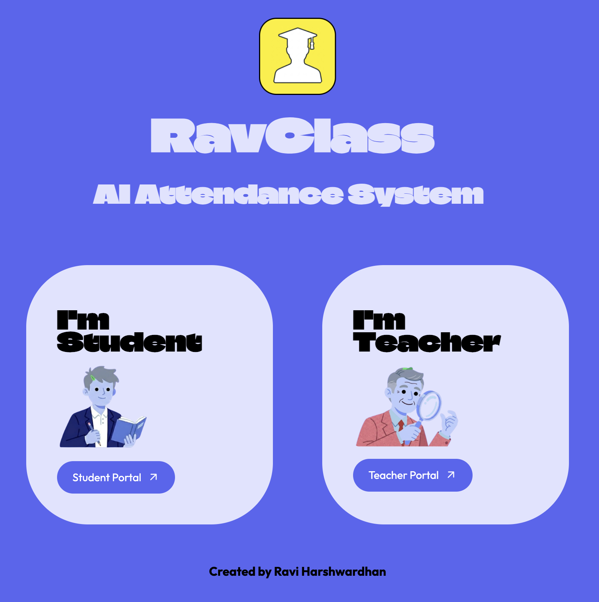
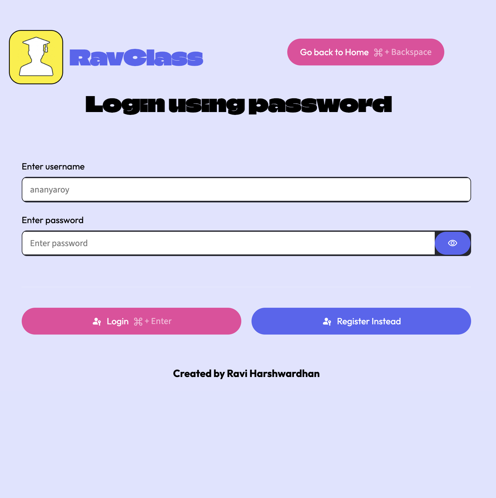
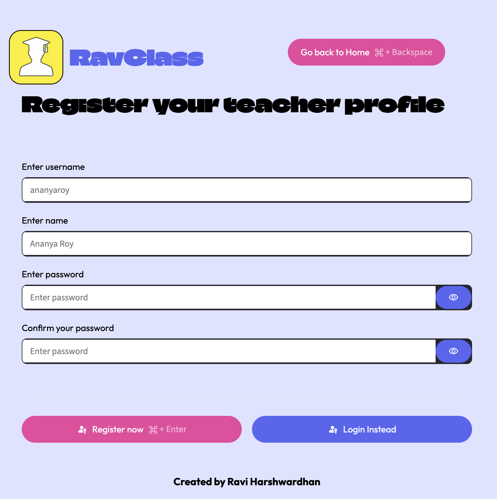
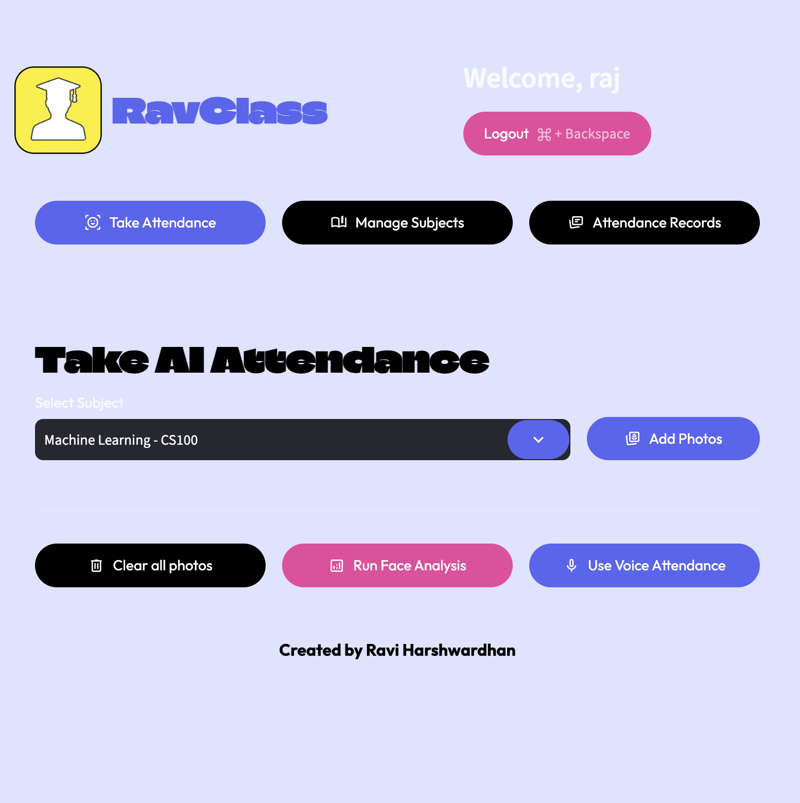
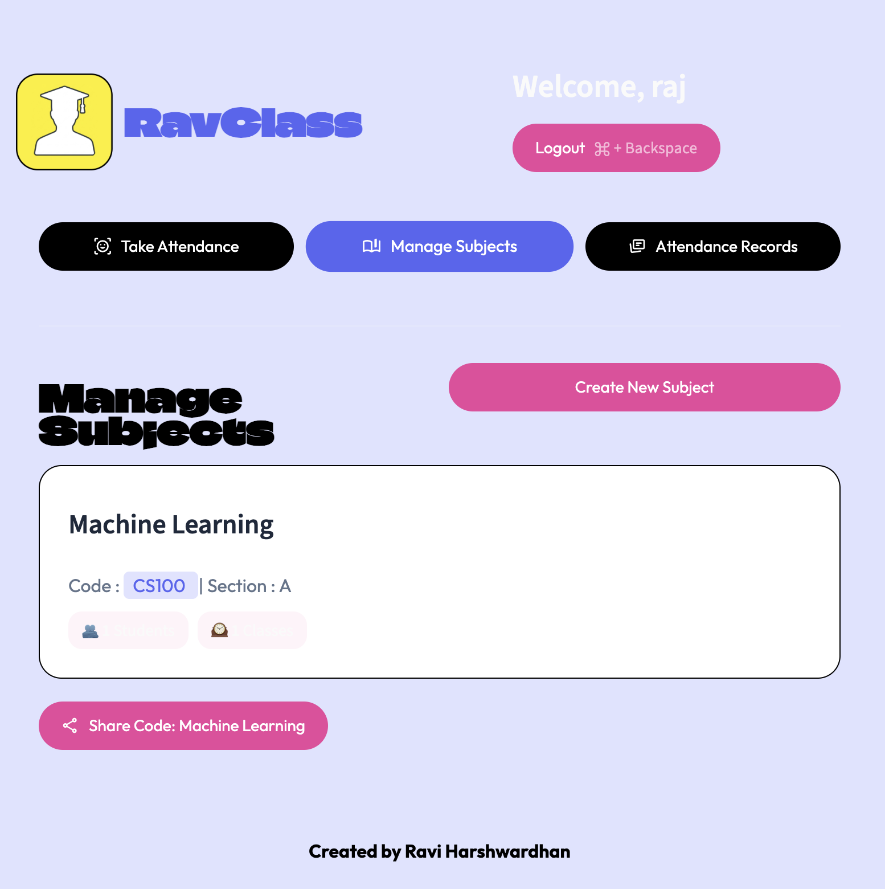
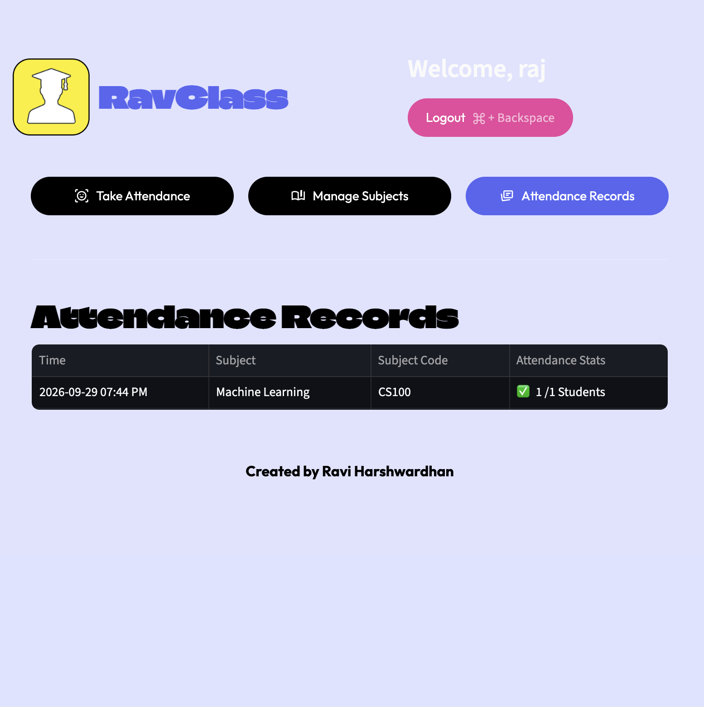
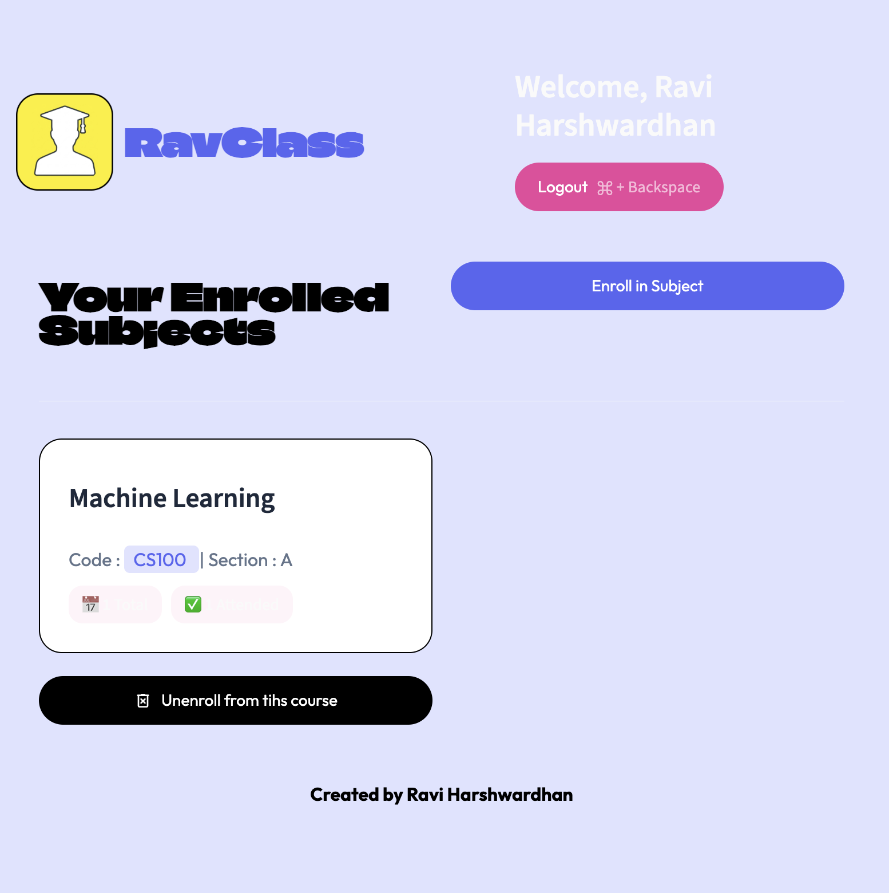

<div align="center">

# 🎓 RavClass — AI Attendance System

**Take a class photo or record the room — RavClass marks who's present.**

Face recognition and voice recognition attendance for classrooms, built with Streamlit, dlib and Supabase.




</div>

---

## 📌 Overview

Taking attendance by roll call wastes class time and is easy to fake. **RavClass** automates it:

- A **teacher** uploads (or snaps) one or more classroom photos. Every face is detected, converted into a 128‑dimensional embedding, and matched against enrolled students.
- Alternatively, the teacher records classroom audio and students are identified by **voice**.
- **Students** sign in with **FaceID** — no password — and join classes by scanning a QR code.

All profiles, subjects, enrollments and attendance logs live in **Supabase (PostgreSQL)**.

---

## ✨ Features

### 👩‍🏫 Teacher Portal
- **Secure accounts** — register/login with passwords hashed using `bcrypt`
- **Manage subjects** — create subjects with a code and section, see enrolled student and class counts
- **Share via QR code** — generate a join link + QR code so students can enroll instantly
- **Take AI Attendance**
  - Add multiple photos (camera snapshot or file upload)
  - **Run Face Analysis** — detects every face in the group photo and marks matched students present
  - **Use Voice Attendance** — identify students from a classroom audio recording
- **Attendance Records** — per‑session history with present / total counts

### 🧑‍🎓 Student Portal
- **FaceID login** — sign in with your webcam, no password needed
- **Register a profile** with your face, plus optional **voice enrollment**
- **Enroll / unenroll** in subjects using a subject code or a teacher's QR link
- See total classes and classes attended per subject

### ⌨️ Keyboard shortcuts
`⌘ + Enter` to submit login/registration, `⌘ + Backspace` to go back or log out.

---

## 📸 Screenshots

| Teacher Login | Teacher Registration |
|:---:|:---:|
|  |  |

| Take AI Attendance | Manage Subjects |
|:---:|:---:|
|  |  |

| Attendance Records | Student Dashboard |
|:---:|:---:|
|  |  |

---

## 🧠 How the AI Works

### Face recognition pipeline (`src/pipelines/face_pipeline.py`)

```
Classroom photo ──► dlib HOG face detector ──► 68‑point shape predictor
                                                       │
                                                       ▼
            Present ✅  ◄── distance ≤ 0.6 ◄── Linear SVM ◄── 128‑D face embedding (dlib ResNet)
```

1. **Detection** — dlib's frontal face detector finds every face in the image.
2. **Embedding** — each face is aligned with the shape predictor and encoded into a 128‑D vector using dlib's ResNet face recognition model.
3. **Classification** — a linear **SVM** (`scikit-learn`, `class_weight='balanced'`) trained on all registered students' embeddings predicts the most likely student.
4. **Verification** — the prediction is accepted only if the Euclidean distance to that student's stored embedding is **≤ 0.6**, which rejects unknown faces.

The trained model is cached with `st.cache_resource` and retrained when new students register.

### Voice recognition pipeline (`src/pipelines/voice_pipeline.py`)

1. Audio is loaded and resampled to 16 kHz with **librosa**.
2. **Resemblyzer**'s `VoiceEncoder` produces a speaker embedding (d‑vector).
3. The embedding is compared with enrolled students' voice embeddings using cosine similarity; the best match is accepted at **≥ 0.65**.

---

## 🛠️ Tech Stack

| Layer | Tools |
|---|---|
| Frontend / App | Streamlit |
| Face recognition | dlib, face_recognition_models, scikit-learn (SVM), NumPy |
| Voice recognition | Resemblyzer, librosa |
| Database & backend | Supabase (PostgreSQL) |
| Auth | bcrypt (teachers), FaceID (students) |
| Utilities | pandas, Pillow, segno (QR codes) |

---

## 📂 Project Structure

```
RavClass-AI-Attendance/
├── app.py                         # Entry point — routes between home / teacher / student
├── requirements.txt
└── src/
    ├── screens/
    │   ├── home_screen.py         # Role selection (Student / Teacher)
    │   ├── teacher_screen.py      # Login, register, attendance, subjects, records
    │   └── student_screen.py      # FaceID login, registration, enrolled subjects
    ├── pipelines/
    │   ├── face_pipeline.py       # Face detection, embeddings, SVM classifier
    │   └── voice_pipeline.py      # Speaker embeddings and matching
    ├── database/
    │   ├── config.py              # Supabase client (reads Streamlit secrets)
    │   └── db.py                  # All database queries
    ├── components/                # Dialogs: add photos, voice attendance, enroll,
    │                              # share QR, create subject, results, header/footer
    └── ui/
        └── base_layout.py         # Global styling
```

---

## 🚀 Getting Started

### 1. Clone the repository

```bash
git clone https://github.com/ravihw7/RavClass-AI-Attendance.git
cd RavClass-AI-Attendance
```

### 2. Create a virtual environment and install dependencies

```bash
python -m venv venv
source venv/bin/activate        # Windows: venv\Scripts\activate
pip install -r requirements.txt
```

> `dlib-bin` provides prebuilt dlib wheels, so you don't need CMake or a C++ compiler on most systems.

### 3. Set up Supabase

Create a project at [supabase.com](https://supabase.com) and add these tables:

| Table | Key columns |
|---|---|
| `teachers` | `teacher_id`, `username`, `password`, `name` |
| `students` | `student_id`, `name`, `face_embedding` (float array / jsonb), `voice_embedding` (float array / jsonb) |
| `subjects` | `subject_id`, `subject_code`, `name`, `section`, `teacher_id` → `teachers` |
| `subject_students` | `student_id` → `students`, `subject_id` → `subjects` |
| `attendace_logs` | `student_id` → `students`, `subject_id` → `subjects`, `timestamp`, `is_present` |

> Note: the attendance table is named `attendace_logs` in the code — keep the same spelling when creating it.

### 4. Add your secrets

Create `.streamlit/secrets.toml` in the project root:

```toml
SUPABASE_URL = "https://your-project-id.supabase.co"
SUPABASE_SECRET_KEY = "your-supabase-key"
```

Don't commit this file — add `.streamlit/secrets.toml` to `.gitignore`.

### 5. Run the app

```bash
streamlit run app.py
```

Open http://localhost:8501 in your browser.

---

## 🧭 Usage

1. **Teacher:** register → log in → **Manage Subjects** → **Create New Subject**.
2. **Teacher:** click **Share Code** to show the QR code / join link to the class.
3. **Student:** open the Student Portal → register with a face photo (and optionally a voice sample) → enroll using the code or QR link.
4. **Teacher:** **Take Attendance** → pick the subject → **Add Photos** → **Run Face Analysis** (or **Use Voice Attendance**) → review and save.
5. **Teacher:** view the session history in **Attendance Records**.

---

## 🔮 Future Improvements

- Liveness detection to prevent photo spoofing at FaceID login
- Export attendance reports to CSV / Excel
- Per‑student attendance percentage and low‑attendance alerts
- Store multiple face embeddings per student for better accuracy across lighting and angles

---

## 👨‍💻 Author

**Ravi Harshwardhan** — AI/ML Engineer

[](https://github.com/ravihw7)
[](https://www.linkedin.com/in/ravihwoff)

If you found this project useful, consider giving it a ⭐!
